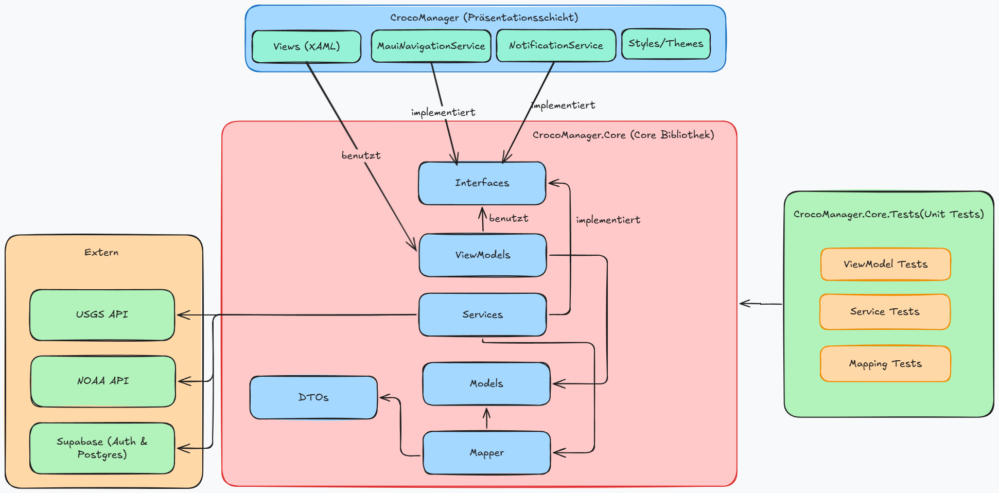

# Projektdokumentation: CrocoFeeding Manager 🐊

## 1. Projektübersicht & Vision
Der **CrocoFeeding Manager** ist eine plattformübergreifende Anwendung (.NET MAUI), die speziell für die Anforderungen eines Wildtierreservats in den Everglades entwickelt wurde. Die App digitalisiert zwei kritische Prozesse:
1.  **Ranger-Betrieb:** Effiziente Fütterungsplanung und -durchführung.
2.  **Forschung:** Präzise Protokollierung des Tierverhaltens unter Einbeziehung von Live-Umweltdaten.

---

## 2. Architektur (Clean Architecture)

Um die Wartbarkeit und Testbarkeit auf professionellem Niveau sicherzustellen, folgt das Projekt einer strikten Schichtentrennung.

### 2.1 Die Schichtenstruktur
Das Projekt ist physisch in drei Einheiten unterteilt:
*   **CrocoManager.Core (Die Intelligenz):** Eine reine .NET-Bibliothek. Hier befinden sich alle Geschäftsregeln, Datenmodelle und – als architektonisches Highlight – sämtliche **ViewModels**. Durch diesen Aufbau ist die gesamte App-Logik zu 100% unabhängig von der Benutzeroberfläche und kann ohne Emulator getestet werden.
*   **CrocoManager (Die Hülle):** Die MAUI-App, die nur für das visuelle Layout (XAML) und die Hardware-Anbindung zuständig ist.
*   **CrocoManager.Core.Tests:** Das automatisierte Prüfmodul.

> **Visualisierung:** 

### 2.2 Effizienz durch Vererbung (DRY-Prinzip)
Um Code-Duplikate zu vermeiden ("Don't Repeat Yourself"), wurden generische Basisklassen implementiert:

*   **BaseService<T>:** Nutzt C# Generics, um Standard-Datenbankoperationen (CRUD) zentral für alle Datentypen (Tiere, Pläne, Beobachtungen) bereitzustellen. Ein neuer Service benötigt somit fast keinen eigenen Code mehr für die Basis-Kommunikation mit Supabase.
*   **BaseViewModel:** Zentralisiert globale Logik wie Benutzerberechtigungen, Ladestatus-Management und das Navigations-System.

> **Visualisierung:** 

### 2.3 Interface-Based Design
Jeder Service (Navigation, Benachrichtigung, Datenbank) wird über ein **Interface** angesprochen. Dies ermöglicht **Dependency Injection**: Die App kann zur Laufzeit die echten Dienste nutzen, während die Tests "Mocks" (Platzhalter) verwenden. Dies ist der Schlüssel zur hohen Testabdeckung.

---

## 3. Externe Schnittstellen & Datenverarbeitung

### 3.1 Live-API Integration
Die App wertet wissenschaftliche Beobachtungen durch Echtzeit-Daten auf:
*   **USGS API:** Liefert aktuelle Wasserdaten (Salzgehalt, Temperatur).
*   **NOAA API:** Liefert Wetterdaten der Everglades.
*   **Daten-Sicherheit:** Alle Daten werden in einer **PostgreSQL-Datenbank (Supabase)** persistiert, inklusive eines rollenbasierten Zugriffssystems (Admin, Ranger, Scientist).

---

## 4. Qualitätssicherung (Testing)

Die Qualitätssicherung folgt einem klaren Plan: Kritische Logik wird **automatisiert** geprüft, visuelle Aspekte **manuell**.

### 4.1 Anforderungen & Testabdeckung (nach Rupp)
Jeder Test referenziert direkt eine funktionale Anforderung (FA) oder nicht-funktionale Anforderung (NFA).

| ID | Anforderung | Testmethode | Ergebnis |
| :--- | :--- | :--- | :---: |
| **FA-04** | Benutzer-Anmeldung | Automatisiert (`LoginViewModelTests`) | ✅ |
| **FA-07** | Tiere anlegen | Automatisiert (`AnimalViewModelTests`) | ✅ |
| **FA-13** | Löschschutz für aktive Pläne | Automatisiert (`FeedingPlanViewModelTests`) | ✅ |
| **FA-17** | Validierung Fütterungsauswahl | Automatisiert (`FeedingViewModelTests`) | ✅ |
| **FA-21** | Pflichtfelder bei Beobachtungen | Automatisiert (`ObservationViewModelTests`) | ✅ |
| **NFA-03** | Fehlerbehandlung (z.B. Alter < 0) | Automatisiert (`AnimalViewModelTests`) | ✅ |
| **NFA-02** | API-Antwortzeit / Timeouts | Automatisiert (`ObservationServiceTests`) | ✅ |
| **FA-01** | E-Mail Whitelist (Admin) | Manuell (Funktionstest UI) | ✅ |
| **FA-06** | Tierliste anzeigen | Manuell (Visuelle Prüfung) | ✅ |
| **NFA-01** | Ladezeit Hauptansichten | Manuell (Messung < 5 Sek.) | ✅ |
| **NFA-06** | Windows & Android Kompatibilität | Manuell (Plattform-Test) | ✅ |

### 4.2 Metriken
Durch das Refactoring der ViewModels in den Core-Teil konnte eine außergewöhnliche Testtiefe erreicht werden:

| Bereich | Abdeckung (ca. %) | Bemerkung |
| :--- | :---: | :--- |
| **Logik & Validierung** | > 95 % | Gesamte Kernlogik ist automatisiert abgesichert. |
| **Daten-Integrität** | 100 % | Alle Mapper (DTO zu Model) sind durch Unit Tests geprüft. |
| **Gesamtprojekt** | **~94 %** | (Basierend auf der kritischen Geschäftslogik) |