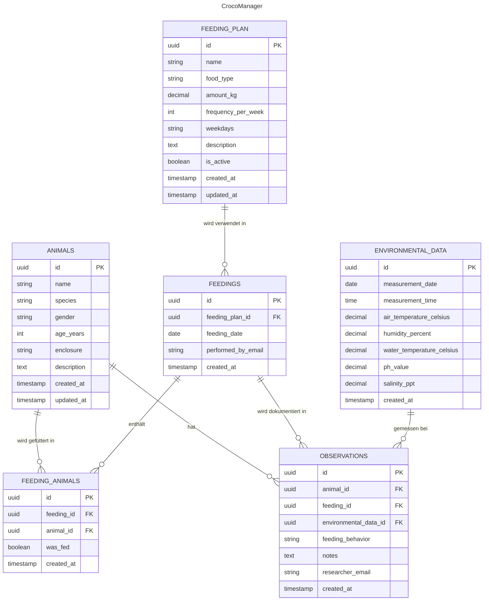

# ERD

Um mit der Applikation sinnvoll arbeiten zu können, wird auf eine PostgreSQL-Datenbank gesetzt, die von unserem Backend-as-a-Service Supabase bereitgestellt wird. Auf dieser läuft das unten ausgearbeitete Datenbankschema. 

Als Primary Keys werden UUIDs verwendet, was dem PostgreSQL-Standard entspricht. C# bietet mit dem Datentyp `Guid` eine native Unterstützung für UUIDs, sodass die Arbeit mit diesen Werten problemlos möglich ist. Ein weiterer Vorteil von UUIDs ist ihre Eignung für verteilte Systeme, da sie global eindeutig sind und keine Kollisionen verursachen. Dies macht die Wahl dieses Datentyps besonders zukunftssicher, falls das System später skaliert oder erweitert werden soll.

| Tabelle            | Beschreibung                                                                       |
|:-------------------| :----------------------------------------------------------------------------------|
| ANIMALS            | Verwaltung aller Tiere im Reservat mit Stammdaten wie Name, Art, Alter und Gehege  |
| FEEDING_PLANS      | Definition von Fütterungsplänen mit Futterart, Menge und Frequenz                  |
| FEEDINGS           | Dokumentation durchgeführter Fütterungen mit Datum und verwendetem Plan            |
| FEEDING_ANIMALS    | Zuordnungstabelle, welche Tiere bei welcher Fütterung gefüttert wurden             |
| OBSERVATIONS       | Wissenschaftliche Beobachtungen zum Fressverhalten der Tiere                       |
| ENVIRONMENTAL_DATA | Umweltdaten (Wetter, Wasserqualität) zum Zeitpunkt der Beobachtungen               |
